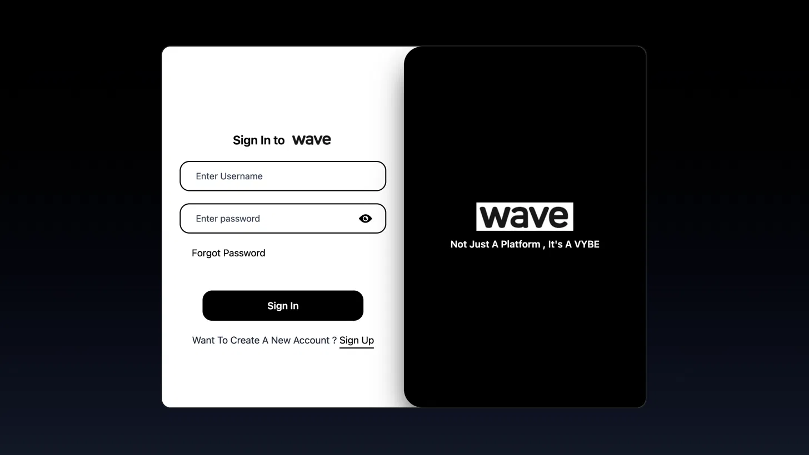
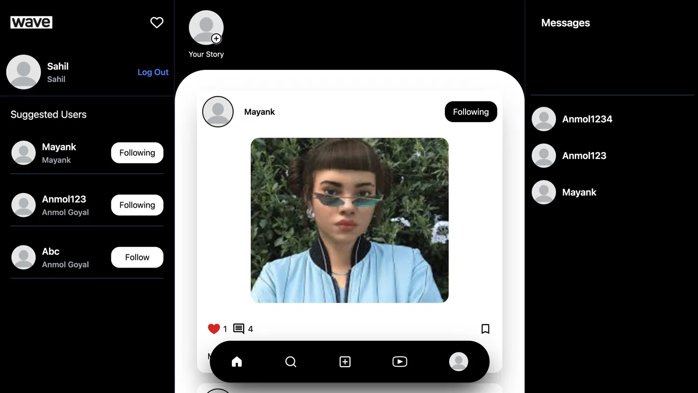

<div align="center">

# 🌊 Wave

**A full-stack, real-time social media platform** — share posts, post short video loops, run 24-hour stories, chat live, and grow your network.

*Not just a platform, it's a VYBE.*

Built with the MERN stack, Socket.IO, Redux Toolkit, and Tailwind CSS.

[](https://react.dev)
[](https://nodejs.org)
[](https://www.mongodb.com)
[](https://socket.io)
[](https://tailwindcss.com)

</div>

---

## 📸 Screenshots

<div align="center">

| Sign In | Home Feed |
|---|---|
|  |  |

</div>

## ✨ Features

- 🔐 **Authentication** — sign up / sign in with JWT (cookie-based sessions), OTP email verification, and forgot/reset password flow (via Resend / Nodemailer)
- 📝 **Posts** — upload images or video, like, comment, and save posts to your profile
- 🎞️ **Loops** — short-form video reels with likes and comments
- 📸 **Stories** — 24-hour disappearing stories with view tracking
- 💬 **Real-time messaging** — one-to-one chat with image sharing and live delivery via Socket.IO, plus online-user presence
- 🔔 **Notifications** — real-time notifications with read/unread state
- 👤 **Profiles** — editable profile (avatar, bio, profession, gender), follow/unfollow, followers/following lists
- 🔍 **Search & Discovery** — search users, suggested-users feed
- ☁️ **Media storage** — uploads handled with Multer and stored on Cloudinary

## 🧱 Tech Stack

**Frontend**
- React 19 + Vite
- Redux Toolkit / React Redux (state management)
- React Router v7
- Tailwind CSS v4
- Axios, Socket.IO Client
- React Icons, React Spinners

**Backend**
- Node.js + Express 5
- MongoDB + Mongoose
- Socket.IO (real-time engine)
- JWT + bcrypt.js (auth & password hashing)
- Multer + Cloudinary (media uploads)
- Nodemailer / Resend (transactional email & OTP)
- Cookie-parser, CORS, dotenv

## 📁 Project Structure

```
Wave/
├── backend/
│   ├── config/          # DB, Cloudinary, mail, and token config
│   ├── controllers/     # Route handler logic (auth, user, post, loop, story, message)
│   ├── middlewares/     # Auth guard, Multer upload config
│   ├── models/          # Mongoose schemas (User, Post, Loop, Story, Message, Conversation, Notification)
│   ├── routes/          # Express routers for each resource
│   ├── socket.js        # Socket.IO server setup & presence tracking
│   └── index.js         # App entry point
│
└── frontend/
    ├── src/
    │   ├── components/  # Reusable UI (Feed, Post, Nav, StoryCard, LoopCard, Messages, etc.)
    │   ├── pages/        # Route-level views (Home, Loops, Story, Messages, Profile, Auth, etc.)
    │   ├── hooks/        # Custom hooks for data fetching
    │   ├── redux/        # Redux Toolkit slices & store
    │   └── main.jsx / App.jsx
    └── vite.config.js
```

## 🚀 Getting Started

### Prerequisites
- [Node.js](https://nodejs.org/) (v18+ recommended)
- A [MongoDB](https://www.mongodb.com/) database (local or Atlas)
- A [Cloudinary](https://cloudinary.com/) account for media storage
- A [Resend](https://resend.com/) account (or SMTP credentials) for sending emails/OTPs

### 1. Clone the repository
```bash
git clone https://github.com/realmayanknarang/Wave.git
cd Wave
```

### 2. Backend setup
```bash
cd backend
npm install
```

Create a `.env` file inside `backend/` with the following variables:

```env
PORT=5000
MONGODB_URL=your_mongodb_connection_string
JWT_SECRET=your_jwt_secret

CLOUDINARY_CLOUD_NAME=your_cloudinary_cloud_name
CLOUDINARY_API_KEY=your_cloudinary_api_key
CLOUDINARY_API_SECRET=your_cloudinary_api_secret

RESEND_API_KEY=your_resend_api_key
```

Run the backend in dev mode:
```bash
npm run dev
```

### 3. Frontend setup
```bash
cd ../frontend
npm install
npm run dev
```

The frontend will start on Vite's default port (typically `http://localhost:5173`), and the backend API on `http://localhost:5000` (or your configured `PORT`).

> ⚠️ **Note:** The backend currently has its CORS `origin` hardcoded to a deployed URL in `backend/index.js`. Update this to `http://localhost:5173` (or your frontend URL) for local development.

## 🔌 API Overview

| Resource | Base Route | Description |
|---|---|---|
| Auth | `/api/auth` | Sign up, sign in, sign out, OTP, password reset |
| User | `/api/user` | Profile, follow system, search, notifications |
| Post | `/api/post` | Upload, feed, like, save, comment |
| Loop | `/api/loop` | Upload, feed, like, comment |
| Story | `/api/story` | Upload, view, fetch by user |
| Message | `/api/message` | Send messages, fetch chat history/threads |

Real-time events (new messages, online presence, notifications) are handled over a Socket.IO connection established alongside the Express server.

## 🖥️ Scripts

| Location | Command | Description |
|---|---|---|
| `backend` | `npm run dev` | Start backend with Nodemon (auto-restart) |
| `frontend` | `npm run dev` | Start Vite dev server |
| `frontend` | `npm run build` | Production build |
| `frontend` | `npm run preview` | Preview production build |
| `frontend` | `npm run lint` | Lint with Oxlint |

## 🤝 Contributing

Contributions, issues, and feature requests are welcome! Feel free to check the [issues page](../../issues) or open a pull request.

1. Fork the project
2. Create your feature branch (`git checkout -b feature/amazing-feature`)
3. Commit your changes (`git commit -m 'Add some amazing feature'`)
4. Push to the branch (`git push origin feature/amazing-feature`)
5. Open a pull request

## 📄 License

This project is available under the [ISC License](LICENSE).

---

<div align="center">
Made with ❤️ by Mayank
</div>